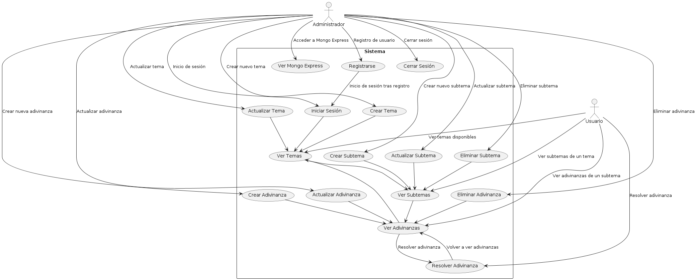
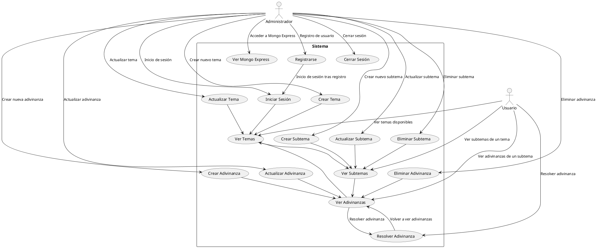
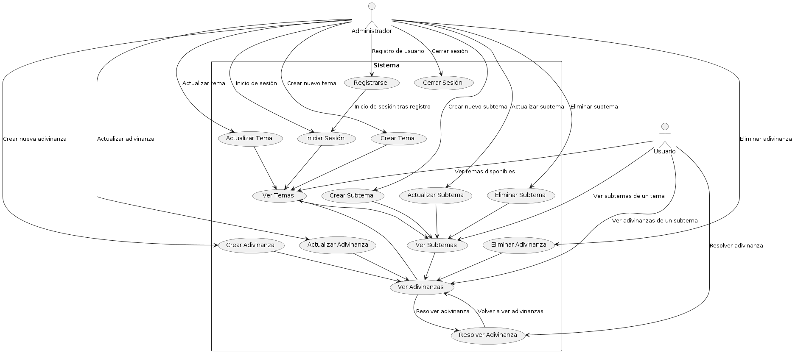
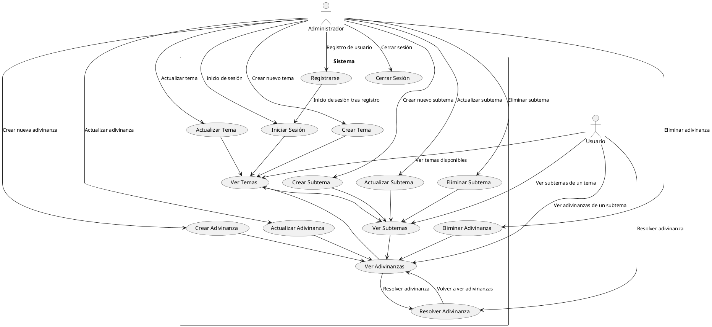

\pagebreak

# Descripción de Diagramas

## Backend

1. **Usuarios**:
   - **Usuario** puede:
     - Ver temas disponibles
     - Ver subtemas de un tema
     - Ver adivinanzas de un subtema
     - Resolver adivinanzas

2. **Administradores**:
   - **Administrador** puede:
     - Registrar un usuario
     - Iniciar sesión
     - Cerrar sesión
     - Crear, actualizar y eliminar temas, subtemas y adivinanzas
     - Acceder a Mongo Express

3. **Sistema**:
   - Gestiona las actividades de registro, inicio y cierre de sesión.
   - Permite la visualización, creación, actualización y eliminación de temas, subtemas y adivinanzas.
   - Facilita a los usuarios la visualización de temas, subtemas y adivinanzas, así como la resolución de estas últimas.

## Frontend

### Actores
- **Usuario**: Interactúa con las funcionalidades de ver y resolver.
- **Administrador**: Tiene acceso completo a las funcionalidades de gestión y administración.

#### Funcionalidades
- **Registrarse**: Permite a un nuevo administrador registrarse en el sistema.
- **Iniciar Sesión**: Permite a los administradores autenticarse en el sistema.
- **Cerrar Sesión**: Permite a los administradores cerrar su sesión.
- **Ver Temas**: Permite ver la lista de temas disponibles.
- **Crear Tema**: Permite a los administradores crear un nuevo tema.
- **Actualizar Tema**: Permite a los administradores actualizar un tema existente.
- **Ver Subtemas**: Permite ver la lista de subtemas dentro de un tema.
- **Crear Subtema**: Permite a los administradores crear un nuevo subtema.
- **Actualizar Subtema**: Permite a los administradores actualizar un subtema existente.
- **Eliminar Subtema**: Permite a los administradores eliminar un subtema existente.
- **Ver Adivinanzas**: Permite ver la lista de adivinanzas dentro de un subtema.
- **Crear Adivinanza**: Permite a los administradores crear una nueva adivinanza.
- **Actualizar Adivinanza**: Permite a los administradores actualizar una adivinanza existente.
- **Eliminar Adivinanza**: Permite a los administradores eliminar una adivinanza existente.
- **Resolver Adivinanza**: Permite a los usuarios resolver una adivinanza específica.

\pagebreak