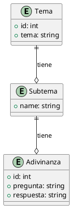

\pagebreak

# Diagrama de la base de datos

## Entidades
- **Tema**
- **Subtema**
- **Adivinanza**

## Atributos
- **Tema**: id, tema
- **Subtema**: name
- **Adivinanza**: id, pregunta, respuesta

## Relaciones
- Un **Tema** puede tener múltiples **Subtemas**.
- Un **Subtema** puede tener múltiples **Adivinanzas**.

## Descripción de las relaciones:
- Un **Tema** tiene una relación uno a muchos con **Subtema**.
- Un **Subtema** tiene una relación uno a muchos con **Adivinanza**.

\pagebreak